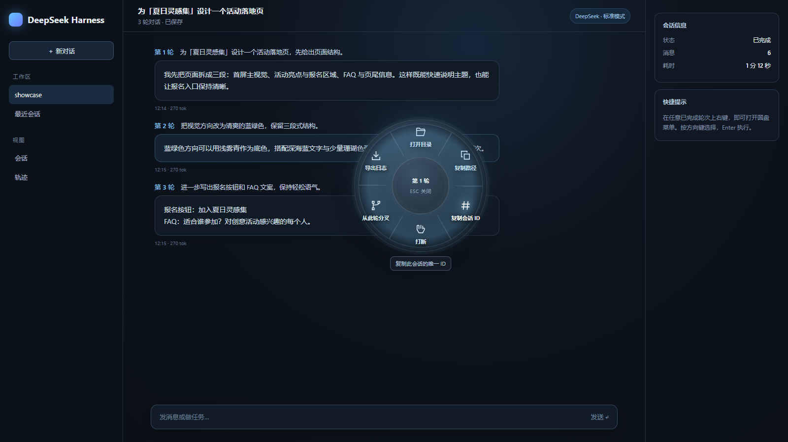
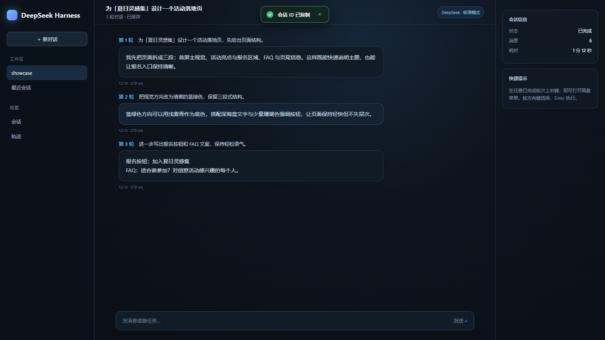

# dsh-round-rightclick

A compact, keyboard-friendly radial context menu for DeepSeek Harness (DSH) Web. Right-click a conversation turn to open workspace, clipboard, generation-control, per-turn branching, and log-export actions where you need them.

[简体中文](README.zh.md) · [Publishing guide](docs/publishing.md) · [Changelog](CHANGELOG.md)


## Why this plugin exists

DSH session actions are easy to lose among page controls and browser menus. This plugin keeps the high-frequency actions in one small wheel next to the conversation: right-click a specific question or answer, choose an action, and continue working.

The key workflow is branching from a precise turn. Explore an idea in the source session, then create a new session from turn 1 or turn 2 without copying later context or changing the source.

## Preview



The wheel uses a standard circle, thin-line SVG icons, separators, and a restrained blue glow. Its default diameter is 240 CSS pixels; it shrinks and repositions near small viewport edges.



Copy, fork, export, and host actions report their state at the top of the page. Success uses a green circular check; errors use a red circular warning icon.

> The images are rendered with a headless browser using synthetic demo data. They contain no real sessions, accounts, or access tokens. `screenshots.json` lists the paths consumed by community catalogs.

## Features

| Action | What it does | Available when |
| --- | --- | --- |
| Open folder | Opens the session workspace in the OS file manager | A local workspace is configured |
| Copy path | Copies the complete workspace path | Clipboard access is available |
| Copy session ID | Copies the current session identifier | A session is open |
| Interrupt | Requests interruption of generation or tool execution | The session is running |
| Fork this turn | Creates and opens a branch containing conversation through the selected turn | The turn is loaded and complete |
| Export log | Downloads current and descendant session logs as a ZIP | The host export service is available |

### Forking from a turn

For a conversation with three completed turns:

```text
Turn 1: clarify the request
Turn 2: compare approaches
Turn 3: polish the copy
```

Right-click turn 1 and choose **Fork this turn** to create a session containing only turn 1. Choosing turn 2 retains turns 1–2. The source session remains unchanged.

The fork point is resolved from the turn-end event sequence, rather than the pointer position or the last event in the session. Running, unloaded, or unrecognised turns are disabled with an explanation; the plugin never silently falls back to copying the whole session.

## Installation

### Release package (recommended)

Download `dsh-round-rightclick-0.1.0.tgz` from [Releases](https://github.com/hmr-BH/dsh-round-rightclick/releases), then run:

```sh
dsh plugin --profile web add ./dsh-round-rightclick-0.1.0.tgz
```

Restart `dsh web` and refresh the page. The archive contains the built entry points, so pnpm and a local build are not required.

### From source

```sh
git clone https://github.com/hmr-BH/dsh-round-rightclick.git
cd dsh-round-rightclick
pnpm install --frozen-lockfile
pnpm run build
dsh plugin --profile web add .
```

Restart `dsh web` after a source install. Remove it with:

```sh
dsh plugin --profile web remove dsh-round-rightclick
```

## Interaction

- Right-click a completed question or answer to open the wheel.
- Hover or use arrow keys to choose an action; press Enter to run it.
- Escape, Tab, scrolling, window blur, or clicking outside closes the menu.
- Releasing the right mouse button never triggers an action.
- The active action is locked while it runs, preventing duplicate requests.
- Inputs, `contenteditable` regions, and other editable controls keep the browser context menu.

## Requirements and limits

- DeepSeek Harness Web. The fork contract was checked against `@deepseek-ai/dsh-api-session-controller` `0.1.2-rc.1` and compatible interfaces.
- Node.js `^22.19.0` or `>=24.0.0`; pnpm is used for source builds.
- A modern browser with SVG, CSS `clip-path`, and Clipboard API support.
- Windows has been exercised locally. macOS and Linux file-manager mappings have automated coverage but still need platform-specific acceptance.
- The plugin targets the Web client and does not add a TUI menu.

## Privacy and permissions

There is no telemetry, advertising, remote service, or extra API key. Actions run only after a click: the plugin reads the current session snapshot, asks the host to open a folder, interrupt, fork, or export, or writes text to the browser clipboard.

Exported logs may contain the conversation and tool output. Review them before sharing.

## Troubleshooting

**No menu appears:** Confirm the plugin is installed in the `web` profile, restart `dsh web`, refresh the page, and right-click conversation content instead of the composer.

**Fork is disabled:** Right-click a specific question or answer, wait for the turn to finish and load its end event, then reopen the menu.

**Clipboard actions fail:** Allow clipboard access for the page and use a supported localhost or HTTPS origin.

**Open folder is unavailable over SSH:** The file manager runs on the DSH host, so remote sessions are rejected instead of opening an unrelated local folder.

## Development and verification

```sh
pnpm install --frozen-lockfile
pnpm typecheck
pnpm test
node scripts/package-release.mjs
```

The test suite contains 47 tests covering menu actions, turn resolution, host routing, clipboard feedback, and component interaction. If a local DSH installation is available, run the host contract check:

```sh
node scripts/verify-installed-dsh.mjs "path/to/installed/@deepseek-ai/dsh"
```

Key files:

```text
src/client/RadialMenu.tsx  rendering, keyboard navigation, and feedback
src/client/menu-layout.ts  wheel geometry and viewport avoidance
src/client/fork-target.ts   completed-turn fork resolution
src/client/index.ts         host session service bindings
src/client/styles.ts        wheel, icon, and top notification styles
src/opener.ts                workspace validation and file-manager calls
tests/                       unit and component tests
```

See [docs/publishing.md](docs/publishing.md) for GitHub Release, Awesome DSH Plugin, dsh-market, and StarPivot submission steps.

## License

[MIT](LICENSE). This is an independent community plugin and is not affiliated with DeepSeek.
